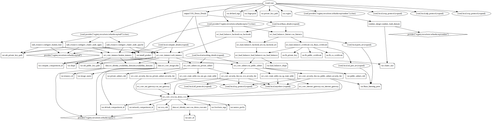

# Best Practices

## Teraform frequently used tools, commands, data structures and instructions

* terraform dependency graph generation: ```terraform graph | dot -Tsvg > graph.svg ```



* terraform console for testing terraform functions outside main project: ``` terraform console ```

```
> matchkeys(["80", "443"], ["80", "443"], ["443"]) 
tolist([
  "443",
])
> matchkeys(["80"], ["80"], ["443"]) 
tolist([])
```

* Project level default compartment VS service dedicated containter

*.auto.tfvars
```
...
# default compartment 
default_compartment_id = "ocid1.compartment.oc1..aaaaaaa..."
...
#############################
# OCI COA network
#############################

# The specific network compartment id. If this is null then the default, project level compartment_id will be used.
network_compartment_id = null
...
#############################
# OCI COA WEB Instances
#############################

# The specific compute compartment id. If this is null then the default, project level compartment_id will be used.
compute_compartment_id = null
```

network.tf

```
...
resource "oci_core_vcn" "coa_demo_vcn" {
  #Required
  compartment_id = var.network_compartment_id != null ? var.network_compartment_id : var.default_compartment_id
...
```

compute.tf

```
...
resource "oci_core_instance" "web_instance" {
  count = var.cluster_size

  #Required
  compartment_id      = var.compute_compartment_id != null ? var.compute_compartment_id : var.default_compartment_id
...
```
* Parametrize optional configuration

Example: Open certain ports

vars.tf

```
...
# LBaaS listening ports
# Accepted values: ["80", "443", "<port number>"] 
variable "lbaas_listening_ports" {
  type        = list(string)
  default     = ["443"]
  description = "Accepted values: [80, 443, port number]"
}
...
```

coa_demo.auto.tfvars

```
...
# LBaaS listening ports
# Accepted values: ["80", "443", "<port number>"] 
lbaas_listening_ports = ["80", "443"]
...
```

networking.tf

```
...
resource "oci_core_security_list" "coa_public_subnet_security_list" {
...
  dynamic "ingress_security_rules" {
    for_each = var.lbaas_listening_ports
    content {
      #Required
      protocol = local.tcp_protocol
      source   = local.anywhere
      #Optional
      description = "Allow ingress for HTTPS:${ingress_security_rules.value} from anywhere"
      source_type = "CIDR_BLOCK"
      stateless   = false
      tcp_options {
        max = ingress_security_rules.value
        min = ingress_security_rules.value
        #Optional
        #source_port_range = 
      }
    }
  }
...
}
```
lbaas.tf

```
...
resource "oci_load_balancer_listener" "coa_listeners" {
  for_each = local.ports_set

  #Required
  default_backend_set_name = oci_load_balancer_backend_set.coa_backend_set.name
  load_balancer_id         = oci_load_balancer_load_balancer.coa_load_balancer.id
  name                     = "${var.names_prefix}listener-${each.key}"
  port                     = each.key
  protocol                 = "HTTP"

  dynamic "ssl_configuration" {
    for_each = each.value == "443" ? toset(["443"]) : toset([])
    content {
      #Optional
      certificate_name        = oci_load_balancer_certificate.coa_lbaas_certificate[ssl_configuration.value].certificate_name
      verify_peer_certificate = false
    }
  }
}
...
```
* debugging 

```
export OCI_GO_SDK_DEBUG=v
export TF_LOG=TRACE
export TF_LOG_PATH=./test1.log
```


## Core Principle - Usability First
Teraform COA deployments are intended to give OCI users a quick start running some piece of software.  As a result we prioritize usability above all else.  A user who knows little to nothing about OCI should be able to stumble in, hit deploy and get a running thing in 5-10 minutes.  Some might argue the system isn't production grade.  That's ok.  It can be improved.  Additional Terraform for more complex systems can be provided.  But, the base version needs to be braindead simple.

## Packages exist for a reason.  Use them.
Yes, there may be a tgz or zip.  Don't use it!  Use the package.  Somebody who knows about the application at hand built a package.  It includes lots of logic you don't want to rewrite.  Follow the three virtues and be lazy!

## We use cloud-init.  We do use not remote-exec or local-exec.
Yes, those are nifty features of Terraform.  That doesn't mean you have to use them.  Before Terraform there was cloud-init.  It's more scalable than SSH'ing into each node.  It's more robust to connectivity issues (like closing your laptop before deploy is done) and it runs asynchronously.  Beyond that, it's the model every other cloud uses.  We use it wherever we can.  If there's some reason we can, then fine, drop down to SSH'ing to a node.

## Reference oci-quickstart-prerequisites or oke-quickstart-prerequisites
Don't create individual env-vars files.  Don't provide an OCI how to in each repo.  Otherwise we're going to end up maintaining many copies of the same thing.

## Repo Structure
* A Quick Start will always be some collection of TF and shell.
* At a minimum a Quick Start will create a VCN and some set of instances.
* A style guide or a generic example template(s) should be developed.
* Since loops and conditionals in TF aren't fully developed (and there are open features/issues around this) we should have standard examples for common constructs.
* For MVP Quick Starts they should deploy to one region and instances requiring HA should be mapped to FD's.
* TF allows at least 3 ways to execute shell on an instance we should standardize on one. The best combination of flexibility and readability may be using user_data resolving TF vars as shell vars inline. Use of remote-exec precludes the use of ORM. ORM can use remote-exec, but that comes with the same issues as running it locally, plus needing to deal with keys differently than locally.
* Gathering information in the shell is in general preferred over passing in a parameter.
* Since referencing a generic module (e.g. a VCN template) in multiple Quick Starts requires CI/CD of the module, at first all Quick Starts should contain all required resources.
* We should conditionalize the use of either NVME or block storage based on shape.

## Documentation
Documentation of a Quick Start should be standardized and contain the same sections:

* Introduction on what the software is and what it's used for.
* Architecture diagram and description of default deployment and any required parameters.
* Detailed description of all parameters.
* Examples of more complicated deployments with arch diagrams if necessary.
* Any necessary post-deploy actions. Note, these should be minimized and ideally there are none.

## Security
* Passwords are set to a non-default value.
* Only required ports are opened.
* Connections allowed only from the user's CIDR block optional.
* No HTTP allowed for management consoles, HTTP ports may be open if they redirect to HTTPS.
* For software that manages the install/config private keys should not be held by OCI. They should be generated on the fly and the public key passed via object storage to instances that need it.

## Inputs/Outputs

### Inputs
* For core terraform modules the recomandation will be to expose as many configurations as possible, following a good logical structure and leveraging complex objects to mirror that structure.
* For solutions build on top of core modules se best jugdment to categorize input parameters inot 2 main categories: 
    * the 1st one that will diferentiate an instance of the solution from the others. These parameters will be yhe only ones exposed in *.tfvars
    * the 2nd one will contain the "default" parameters that, usualy, will have the same values across multiple solution instantiation. These values will be harcoded in proxy modules that sit in between solution ```main.tf``` and the core terraform modules.

The spliting in these 2 different categories is very "subjective" but doing so we will avoid exposing the users of the automation to a large variety/complexity of input parameters and will guide them to the right/monigful configuration options for the respective solution.


### Ouputs 
* For ouputs we have 2 different recomandations:
    * for core terraform modules the ouputs should return all the details of the provisioned resources as the aim for the core modules is reusability in any type of solutions.
    * for solutions uild on top of terraform core modules we should filter and expose exacly the parameters that are of interest for the respectiv provisioned solution.

The output structure should follow a certain determined logic and should be exposed using terraform complex objects that map that logic. The output format that is using complex object can potentialy be easy to consume/parse by external tools like python scripts.

