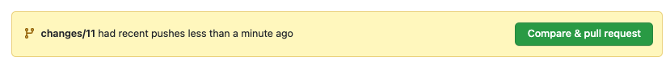
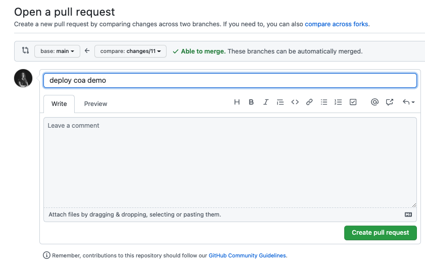
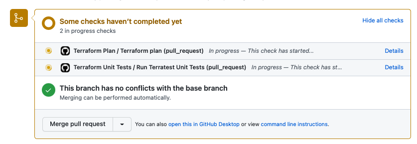
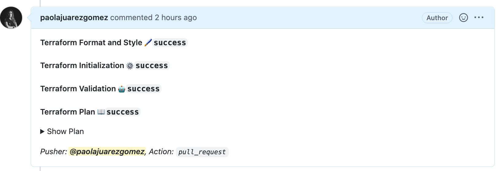
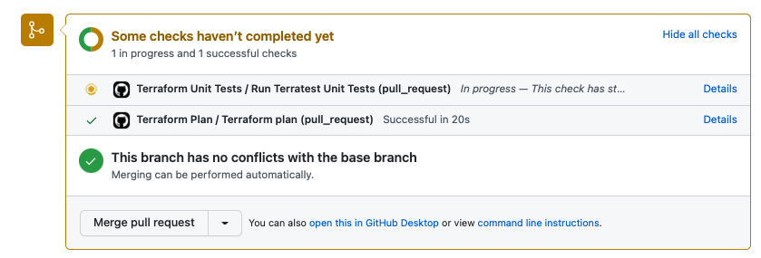
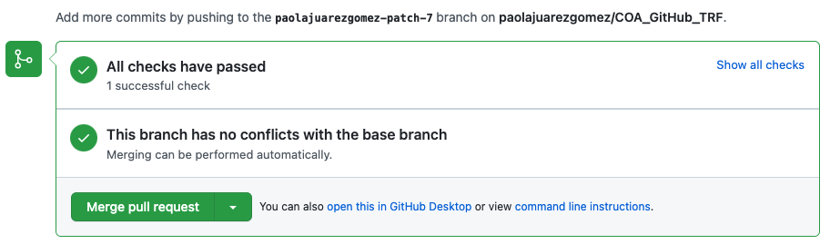
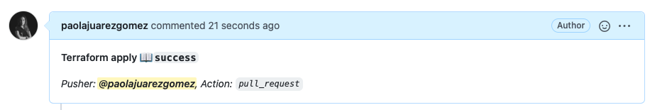
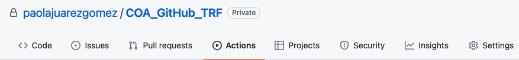

# COA Deploy Ansible with GitHub UseCase. 
# -- How to build ansible pipeline with GitHub Action  --

## ✅ Showcase

GitHub Actions is a continuous integration and continuous delivery (CI/CD) platform that allows you to automate your build, test, and deployment pipeline. You can create workflows that build and test every pull request to your repository, or deploy merged pull requests to production.

A workflow is a configurable automated process that will run one or more jobs. Workflows are defined by a YAML file checked in to your repository and will run when triggered by an event in your repository, or they can be triggered manually, or at a defined schedule.

During this UseCase we're going to:

* Use Github Actions to build different pipelines/workflows.
* Create a test pipeline/workflow using Lint ansible.
* Run gitops operations in an ATP workload using ansible

## ✅ Usage

* Clone this repo in GitHub and create you own repository.
* The first thing you’ll need to do before your GitHub Actions can run is to add your credentials to the repository. To do this you will need to follow these steps:

   * Navigate to your repository and select the Settings tab.
   * Once there you should see on the left a Secrets section third from the bottom of the list, click on that.
   * Click on the New repository secret button. 
   * Add the next secrets:

````

````
* The *token* secret is a personal [github token](https://docs.github.com/en/authentication/keeping-your-account-and-data-secure/creating-a-personal-access-token).
* We want to use a [S3-Compatible Backend](https://docs.oracle.com/en-us/iaas/Content/API/SDKDocs/terraformUsingObjectStore.htm) , read the documentation carefully. You need an OCI object storage [bucket](https://docs.oracle.com/en-us/iaas/Content/API/SDKDocs/terraformUsingObjectStore.htm) called *"terraform-backend"*.

* Create a ["Customer Secret keys"](https://docs.oracle.com/en-us/iaas/Content/Identity/Tasks/managingcredentials.htm#To4) also named as "Amazon S3 Compatibility API keys". A Customer Secret key consists of an Access Key/Secret key pair. 
* Add the *Custome Secret Keys* varibales to the previus ones:

````
access_key_id 
secret_access_key 
````
* If you want to deploy an adb include the admin password:

````
adb_password
````
* If you want to configure the manual backup from the previus adb include the credential password and remember to add you username in the **coa_demo.auto.tfvars** file

````
password
````
* The pipelines/workflows configuration are defined in the directory **.github/workflows**, in this case we have created three different workdlows: **plan.yaml, unit.yaml** and **apply.yaml**
* Add your *api_private_key* to the file **user.pem**
* Add your ssh public and ssh private keys in the cers directory, they will be used to connect to the webservers nodes.
* Rename the file **terraform.tfvars.template** to **terraform.tfvars** and add the value of your *tenancy_ocid* 
* Define the values desired in the  **coa_demo.auto.tfvars** ( mandatory required ssh public key and ssh private key file´s names and your compartment_ocid) 
* Go to settings of your repo, and active the use of workflows.(*Settings-> Actions-> General-> Allow all actions and reusable workflows*)

* The terraform code included in this demo will deploy the next resources:


* Create a new branch, make changes in the repo files and publish the changes to the new branch. 
* Open a "merge pull request" and check how the first two pipelines run:




* This action will start the pipeline test and plan:


* When the plan pipeline ends you can se the actions/github-script@v6  outcome, this allow you to review the plan outcome before approve the merge.




* This is the outcome of actions/github-script@v6 for the test pipeline.


* When you approve the merge, the apply pipeline will be automatically launched.


* Check that now you can see the database and the rest of the resoruces provisioned in your compartment.


* After the provisioning, the outcome of the apply step is showed in the merge request page.(*Pull requests -> closed -> pull request created* )


* If we review tab "actions" , we can check the 3 different pipelines:


* Remove manually (using OCI Console) all the resources created in this demo.

If you need help, ask us in the slack channel #iac-enablement

## ✅ References
* [Understanding GitHub Actions](https://docs.github.com/en/actions/learn-github-actions/understanding-github-actions)
* [Terratest](https://terratest.gruntwork.io/)
* [Automate Terraform Testing with GitHub Actions and Terratest](https://medium.com/@petriautero/automate-terraform-testing-with-github-actions-and-terratest-78d74331fdf8)

