# COA DevOps Training UseCase. 
# -- How to build a pipeline with OCI DevOps --

This example creates an Autonomous Database (JSON) exposed to the public Internet.

## ✅ Showcase

During this UseCase we're going to:

* Use OCI DevOps service.
* Configure a build pipeline.
* Use OCI S3 as a backed for terraform.
* Use OCI Vault for storing sensitive information.
* Deploy IaC using Terraform, in this case an ADB resource.

## ✅ Usage

* Create an object storage [bucket](https://docs.oracle.com/en-us/iaas/Content/API/SDKDocs/terraformUsingObjectStore.htm) called *"terraform-backend"*.
* We want to use a [S3-Compatible Backend](https://docs.oracle.com/en-us/iaas/Content/API/SDKDocs/terraformUsingObjectStore.htm) , read the documentation carefully.
* Create a ["Customer Secret keys"](https://docs.oracle.com/en-us/iaas/Content/Identity/Tasks/managingcredentials.htm#To4) also named as "Amazon S3 Compatibility API keys". A Customer Secret key consists of an Access Key/Secret key pair. 
* Declare the below variables to OCI vault as secrets

````
aws_access_key_id 
aws_secret_access_key 
tenancy_ocid
compartment_ocid
````

* Clone this repo in OraHub, GitLab or GitHub and create you own DevOps repository.
* Fill the correct OCID values of secrets in file **build_spec.yaml**
* Add your *api_private_key* to the file **user.pem**
* Rename the file **terraform.tfvars.template** to **terraform.tfvars** and add the values of your *tenancy_ocid* and *compartment_ocid*
* Define the values of your *region* and *adb_password* in the file **adb.auto.tfvars**
* Define the values of your *region* and *namespace* in the file **remote_backend.tf**
* Create a OCI DevOps Project
* Review [OCI documentation](https://docs.public.oneportal.content.oci.oraclecloud.com/en-us/iaas/Content/devops/using/devops_iampolicies.htm ) and add the required DG and policies. 

* Configure a code repository in DevOps to [mirror](https://docs.oracle.com/en-us/iaas/Content/devops/using/mirror_repo.htm ) the repository you have created in the previous step.
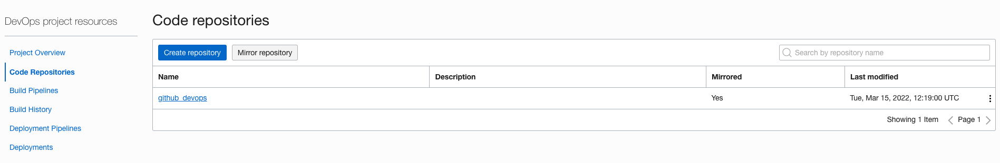

* Create a build pipeline and create a manage build.
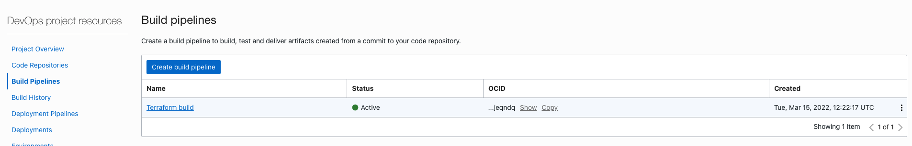
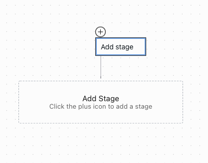
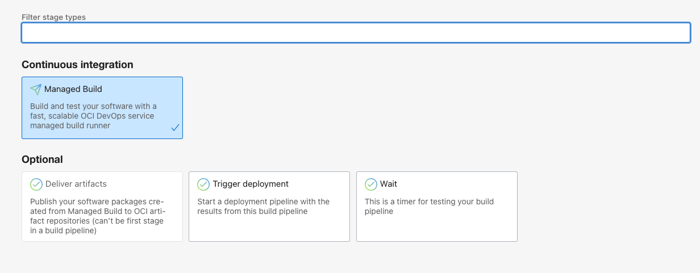
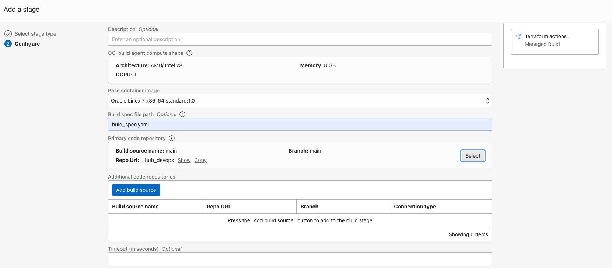
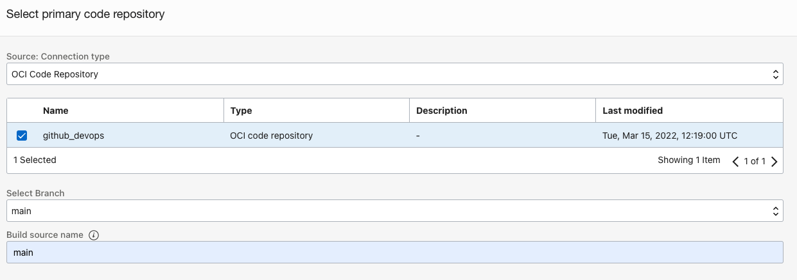

* Enable logging.
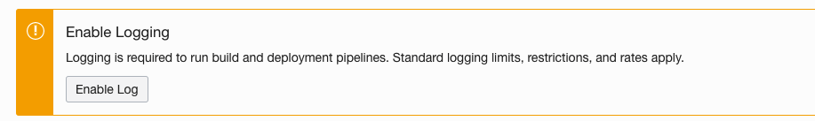

* Run the build pipeline manually and review the implementation.

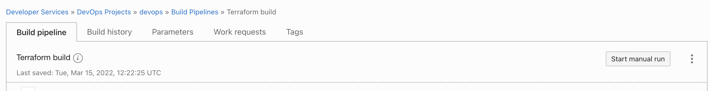

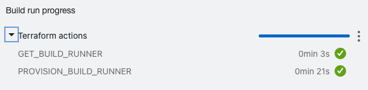

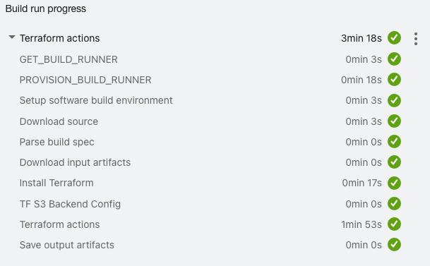
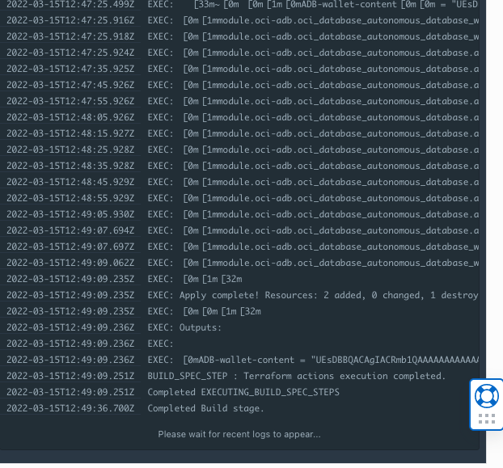

* Check that now you can see the database provisioned in your compartment.


* If you have arrived at this point with a successful outcome, you can add a [trigger](https://docs.oracle.com/en-us/iaas/Content/devops/using/trigger_build.htm#trigger_build) to lunch the pipeline automatically after any push action to your repository.

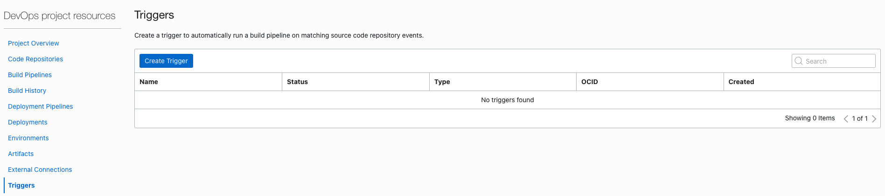
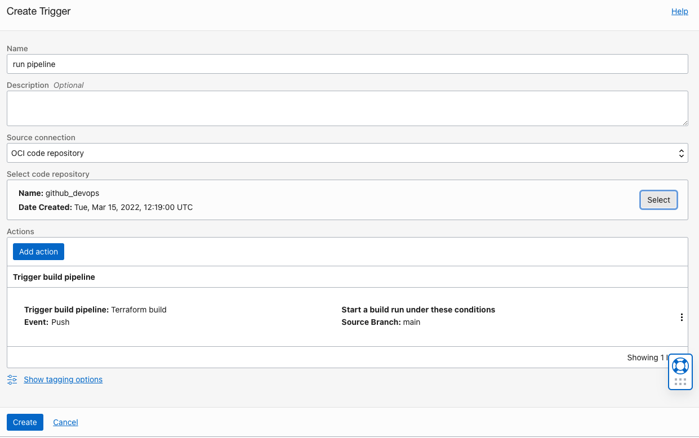
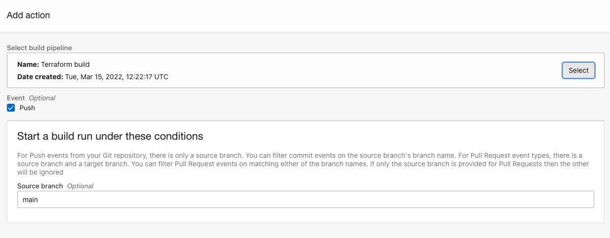

* Remove manually (using OCI Console) the ADB created previously.
* Change you repo code, for example change the ADB name, and push the changes.
* Review the outcome:

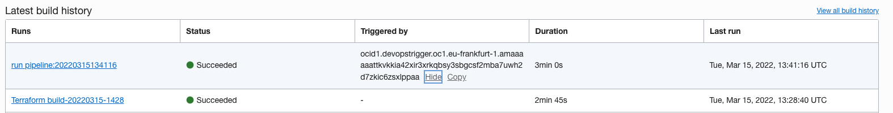
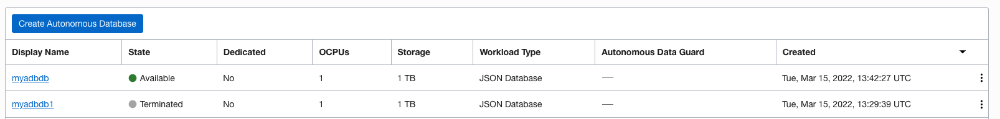

If you need help, ask us in the slack channel #iac-enablement

## ✅ References

* RahulMR42 [https://github.com/RahulMR42/OCI-BuildRunner-With-Terraform-with-S3State](https://github.com/RahulMR42/OCI-BuildRunner-With-Terraform-with-S3State ) 
* OCI Devops -  [https://docs.oracle.com/en-us/iaas/Content/devops/using/home.htm](https://docs.oracle.com/en-us/iaas/Content/devops/using/home.htm) 
* OCI Terraform references - [https://registry.terraform.io/providers/hashicorp/oci/latest/docs](https://registry.terraform.io/providers/hashicorp/oci/latest/docs ) 
* OCI Terraform with S3 backend -[https://docs.oracle.com/en-us/iaas/Content/API/SDKDocs/terraformUsingObjectStore.htm](https://docs.oracle.com/en-us/iaas/Content/API/SDKDocs/terraformUsingObjectStore.htm)
* OCI Object storage -[https://docs.oracle.com/en-us/iaas/Content/Object/home.htm ](https://docs.oracle.com/en-us/iaas/Content/Object/home.htm )
