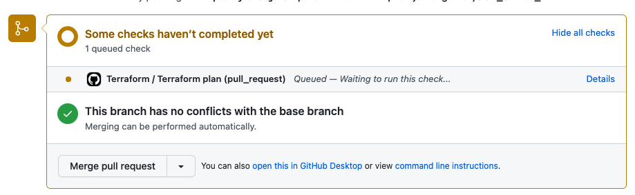
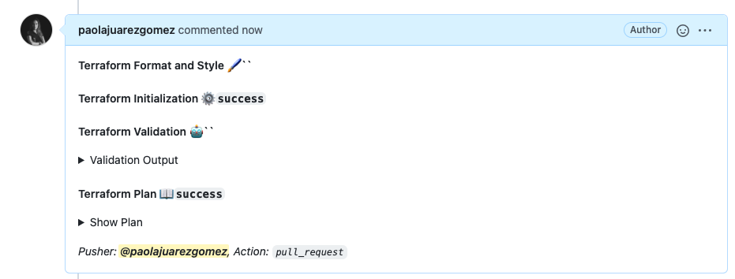
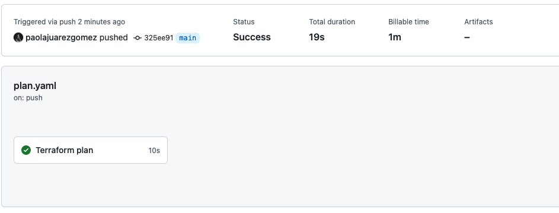
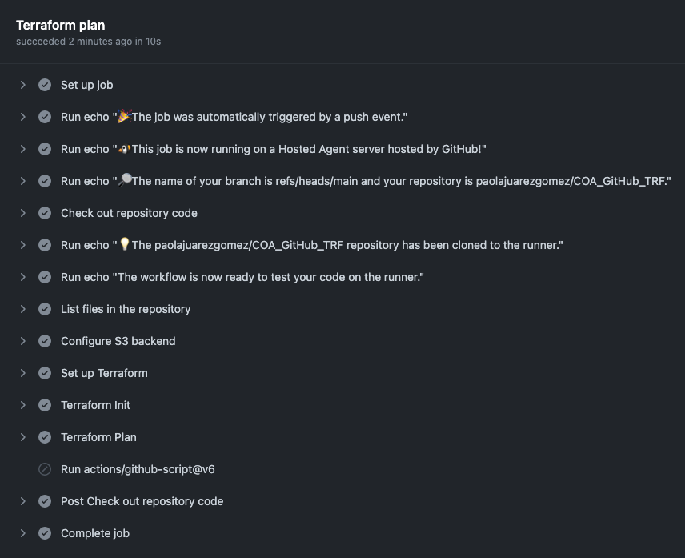
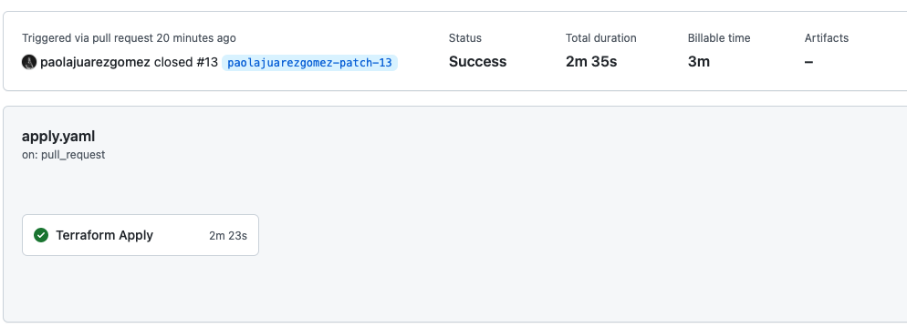
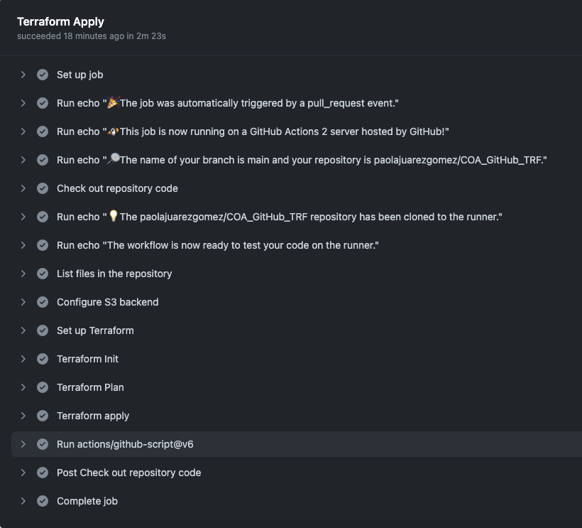
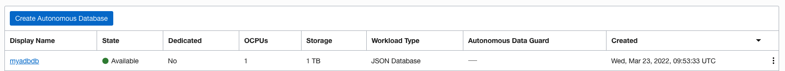

# COA Deploy TRF with GitHub UseCase. 
# -- How to build a pipeline with GitHub Action  --

This example creates an Autonomous Database (JSON) exposed to the public Internet.

## ✅ Showcase

During this UseCase we're going to:

* Use Github Actions to build a pipeline.
* Use OCI S3 as a backed for terraform.
* Deploy IaC using Terraform, in this case an ADB resource.

## ✅ Usage

The first thing you’ll need to do before your GitHub Actions can run is to add your credentials to the repository. To do this you will need to follow these steps:

* Navigate to your repository and select the Settings tab.
* Once there you should see on the left a Secrets section third from the bottom of the list, click on that.
* Click on the New repository secret button.
* Add the next secrets:

````
user_id
api_fingerprint
token
````
* *token* is a personal [github token](https://docs.github.com/en/authentication/keeping-your-account-and-data-secure/creating-a-personal-access-token).

* We want to use a [S3-Compatible Backend](https://docs.oracle.com/en-us/iaas/Content/API/SDKDocs/terraformUsingObjectStore.htm) , read the documentation carefully. You need an OCI object storage [bucket](https://docs.oracle.com/en-us/iaas/Content/API/SDKDocs/terraformUsingObjectStore.htm) called *"terraform-backend"*.

* Create a ["Customer Secret keys"](https://docs.oracle.com/en-us/iaas/Content/Identity/Tasks/managingcredentials.htm#To4) also named as "Amazon S3 Compatibility API keys". A Customer Secret key consists of an Access Key/Secret key pair. 
* Add the *Custome Secret Keys* varibales to the previus ones:

````
access_key_id 
secret_access_key 
````

* Clone this repo in OraHub, GitLab or GitHub and create you own repository.
* The pipelines configuration is defined in .github/workflows, in this case we have created plan.yaml and apply.yaml
* Add your *api_private_key* to the file **user.pem**
* Rename the file **terraform.tfvars.template** to **terraform.tfvars** and add the values of your *tenancy_ocid* and *compartment_ocid*
* Define the values of your *region* and *adb_password* in the file **adb.auto.tfvars**
* Define the values of your *region* and *namespace* in the file **remote_backend.tf**

* Change you repo code, for example change the ADB name, and do a "merge pull request" to deploy the changes.


* This is the outcome of actions/github-script@v6 , you can review the plan outcome before do the merge.


* When you do the merge the workflow with the apply job is launched.


* If we review the pipelines ( plan and apply) in the tab "actions" 


* We can see the different pipelines steps/stages...







* Check that now you can see the database provisioned in your compartment.


* After the provisioning, the outcome of the apply step is showed in the merge request page.


* Remove manually (using OCI Console) the ADB created previously.

If you need help, ask us in the slack channel #iac-enablement

## ✅ References
* [https://acloudguru.com/blog/engineering/how-to-use-github-actions-to-automate-terraform](https://acloudguru.com/blog/engineering/how-to-use-github-actions-to-automate-terraform)
